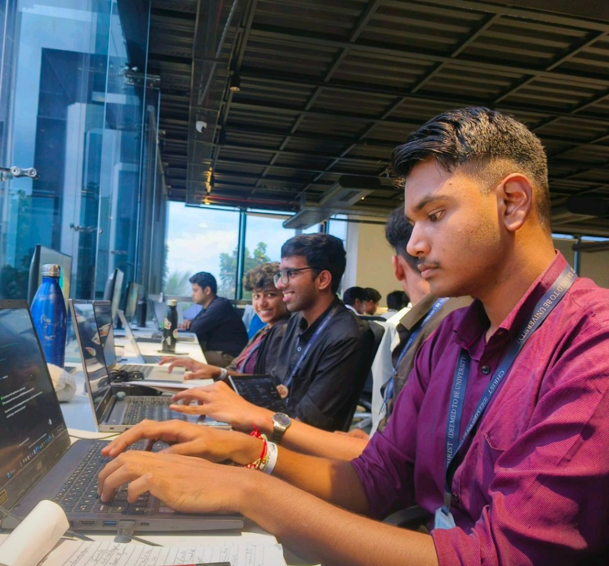

# 🚀 Harshdeep Sharma — 3D Portfolio Website

<div align="center">


**A stunning, interactive 3D portfolio built with Three.js, pure HTML, CSS, and JavaScript.**

[](http://localhost:5500)
[](https://developer.mozilla.org/en-US/docs/Web/HTML)
[](https://developer.mozilla.org/en-US/docs/Web/CSS)
[](https://developer.mozilla.org/en-US/docs/Web/JavaScript)
[](https://threejs.org/)

</div>

---

## 📋 Table of Contents

- [Overview](#-overview)
- [Live Preview](#-live-preview)
- [Features](#-features)
- [Tech Stack](#-tech-stack)
- [Project Structure](#-project-structure)
- [Sections](#-sections)
- [3D Effects & Animations](#-3d-effects--animations)
- [Design System](#-design-system)
- [Getting Started](#-getting-started)
- [Customization Guide](#-customization-guide)
- [Assets](#-assets)
- [Browser Support](#-browser-support)
- [Performance Notes](#-performance-notes)
- [Author](#-author)

---

## 🌟 Overview

This is a **single-page, fully interactive 3D portfolio website** for **Harshdeep Sharma**, a B.Tech Computer Science (AI/ML) student, AI/ML developer intern at L&T Technology Services, and Infosys Springboard alumni.

The portfolio is inspired by the immersive experience of [Bruno Simon's portfolio](https://bruno-simon.com) and features:

- A **live Three.js 3D WebGL canvas** as the background with floating geometric shapes, particles, and a DNA helix
- **Mouse-driven parallax** — the entire 3D world reacts to cursor movement
- **Glassmorphism** card design system throughout
- **Scroll-reveal animations** powered by IntersectionObserver
- A **typing effect** that cycles through taglines on the hero section
- **3D tilt effects** on gallery and journey cards

No frameworks. No build tools. Pure, optimized vanilla web tech.

---

## 🔴 Live Preview

To run locally:

```bash
# Option 1 — Python (recommended, no install needed)
python -m http.server 5500
# Then open: http://localhost:5500

# Option 2 — Node.js (if installed)
npx serve .
# Then open the URL shown in terminal

# Option 3 — VS Code
# Install "Live Server" extension → Right-click index.html → Open with Live Server
```

> ⚠️ **Must be served via HTTP** (not opened as a raw file) because Three.js and Google Fonts require network requests. Opening `index.html` directly via `file://` will cause CORS errors.

---

## ✨ Features

### 🎨 Visual & Design
| Feature | Description |
|---------|-------------|
| **3D WebGL Background** | Three.js powered scene with particles, wireframe shapes, DNA helix & grid floor |
| **Mouse Parallax** | Camera smoothly tracks mouse movement across the 3D scene |
| **Custom Cursor** | Dot + ring follower cursor that scales on hover over interactive elements |
| **Glassmorphism Cards** | Frosted glass UI cards with backdrop-filter blur throughout |
| **Gradient Typography** | Purple→Cyan gradient text on key headings and the logo |
| **Floating Badges** | Animated floating badges around the hero photo |
| **Dark Theme** | Deep space dark background (`#050510`) with vibrant accents |

### ⚙️ Interactions
| Feature | Description |
|---------|-------------|
| **Typing Effect** | Hero tagline cycles through 4 phrases with realistic typing/erasing animation |
| **Scroll Reveal** | Every section and card fades up as it enters the viewport |
| **Skill Bar Animation** | Skill progress bars fill only when the section scrolls into view |
| **3D Tilt Cards** | Gallery and journey photos tilt in perspective on mouse movement |
| **Hero Photo Parallax** | Profile photo tilts subtly in 3D as cursor moves |
| **Smooth Scroll** | CSS `scroll-behavior: smooth` for all anchor navigation |
| **Active Nav Highlight** | Navigation link underline updates as you scroll through sections |
| **Contact Form** | Simulated form submission with loading state and success message |

### 📐 Layout
| Feature | Description |
|---------|-------------|
| **Fully Responsive** | Mobile, tablet, and desktop layouts with CSS Grid & Flexbox |
| **Single Page App** | All sections on one page with smooth scroll navigation |
| **Custom Scrollbar** | Styled scrollbar matching the purple accent color |

---

## 🛠 Tech Stack

| Technology | Purpose | Version |
|-----------|---------|---------|
| **HTML5** | Semantic page structure | — |
| **CSS3** | Styling, animations, glassmorphism, responsive layout | — |
| **Vanilla JavaScript** | Interactions, scroll logic, typing effect, form handling | ES6+ |
| **Three.js** | 3D WebGL background scene | r134 (CDN) |
| **Google Fonts** | Typography — Space Grotesk, Syne, JetBrains Mono | — |

> **Zero build tools, zero npm, zero frameworks.** Everything runs directly in the browser.

---

## 📁 Project Structure

```
potfolio-website/
│
├── index.html              # Main single-page HTML (all sections)
├── style.css               # All styles — design system, components, responsive
├── script.js               # Three.js 3D scene + all JS interactions
│
└── assets/
    └── images/
        ├── photo1.jpg          # Hero section — professional headshot
        ├── photo2.jpg          # About section — candid thinking photo
        ├── photo3.jpg          # Viksit Bharat Exhibition
        ├── photo4.jpg          # VBYLD 2026 — Bharat Mandapam
        ├── photo5.png          # Nataraja statue — Bharat Mandapam
        ├── journey-nasa.jpg    # NASA Space Apps Challenge — team coding
        ├── journey-ieee.jpg    # IEEE Tech Summit 2025 — speaking with mic
        ├── journey-techbiz.jpg # TechBiz Hackathon — team at Presidency University
        └── journey-ev.jpg      # EV Battery Challenge — presenting to C-DAC
```

---

## 📄 Sections

### 1. 🦸 Hero
- Full-screen landing with name, animated tagline (typing effect), badge, CTA buttons
- Circular profile photo with rotating ring borders, glow effect, and 3 floating animated badges
- LinkedIn & GitHub social links
- "Scroll to Explore" animated indicator

### 2. 🙋 About Me
- Two-column layout: photos on left, content on right
- 4 highlight cards (L&T Internship, AI Music System, NASA Space Apps, National Leadership)
- Stats counters: 4+ Years, 10+ Certifications, 3+ Hackathons

### 3. 📸 My Journey
- **Photo Gallery**: 3 tilt-card photos from major national events (VBYLD 2026, Bharat Mandapam, Viksit Bharat Exhibition)
- **Journey Story Cards** (2×2 grid with real event photos):
  - 🛸 **NASA Space Apps Challenge** — International hackathon, global innovation
  - 🎤 **IEEE Tech Summit 2025** — Student panelist, speaking on 6G & future tech
  - ⚡ **TechBiz 25-Hour Hackathon** (Presidency University) — Rapid prototyping under pressure
  - 🔋 **EV Battery Intelligence Challenge** — Top 7 National, AI + Hardware prototype, C-DAC presentation
- Closing statement in large display typography

### 4. 💼 Experience (Timeline)
- Vertical timeline with gradient line and glowing dots
- Cards with role, company, dates, location, description, bullet points, tech stack pills
  - **L&T Technology Services** — AI/ML Developer Intern (Apr 2026 – Present) `CURRENT`
  - **Infosys Springboard** — ML & Full Stack Engineer Intern (Sep–Nov 2025)
  - **Vennture** — Agency Manager (Aug 2024 – Apr 2025)
  - **Freelance Designer** (Mar 2021 – Apr 2025)

### 5. ⚡ Skills
- 6-category skill grid (glassmorphism cards): AI/ML, Programming, Full-Stack, Tools, Leadership, Creative
- Animated progress bars: Python/AI (92%), Generative AI (88%), Full-Stack (80%), Computer Vision (75%), Leadership (95%)

### 6. 🎓 Education & Certifications
- 3 education cards: B.Tech Christ University, Senior Secondary & High School (Kendriya Vidyalaya)
- 6 certification cards: Infosys (3), AWS, Google AI Studio, Multilingual AI Speech App

### 7. 📬 Contact
- Left: contact info cards (Phone, Email, LinkedIn, GitHub, Location)
- Right: contact form with animated inputs, submit button with loading state, success message

---

## 🌌 3D Effects & Animations

### Three.js Scene (`script.js`)

| Element | Detail |
|---------|--------|
| **Purple Particle Field** | 3,000 points spread across 200 units, slow Y+X rotation |
| **Cyan Particle Field** | 1,500 points, counter-rotating with Z-axis drift |
| **Amber Particles** | 800 larger points for depth variation |
| **Icosahedron** | Wireframe, purple, top-left position, floating rotation |
| **Octahedron** | Wireframe, cyan, right side |
| **Torus** | Wireframe, amber/gold, top-right, slower rotation |
| **Tetrahedron** | Wireframe, purple, bottom-left |
| **Torus Knot** | Wireframe, cyan, center-bottom, complex rotation |
| **Dodecahedron** | Wireframe, amber, far-left |
| **DNA Helix** | Line geometry forming a double helix, purple, spins on Y-axis |
| **Grid Floor** | 200×200 unit grid, very low opacity, purple tint |
| **Point Lights** | Two colored point lights (purple + cyan) that pulse in intensity |

### Camera Behavior
The camera position is driven by mouse coordinates. As you move the mouse, `targetX/Y` update, and the camera lerps toward that position every frame — creating the sensation that the 3D world responds to you.

### CSS Animations
| Animation | Used On |
|-----------|---------|
| `fadeUp` | Hero text elements (staggered delay) |
| `float` | Hero floating badges (infinite bounce) |
| `spin` | Hero photo ring borders |
| `scrollLine` | Scroll hint vertical line pulse |
| `blink` | Typing cursor |
| `load` | Loader progress bar |

---

## 🎨 Design System

### Color Palette (`style.css` CSS Variables)

```css
--bg:          #050510   /* Deep space background */
--bg2:         #0a0a1a   /* Slightly lighter background */
--accent:      #7c3aed   /* Primary purple */
--accent2:     #06b6d4   /* Cyan / teal */
--accent3:     #f59e0b   /* Amber / gold (highlights, EV card) */
--text:        #e2e8f0   /* Primary text */
--text-muted:  #94a3b8   /* Secondary / descriptive text */
--glass:       rgba(255,255,255,0.04)   /* Glass card background */
--glass-border:rgba(255,255,255,0.08)  /* Glass card border */
--radius:      16px      /* Default border radius */
```

### Typography

| Font | Weight | Usage |
|------|--------|-------|
| **Syne** | 700, 800 | Display headings (hero name, section titles) |
| **Space Grotesk** | 300–700 | Body text, UI elements |
| **JetBrains Mono** | 400, 500 | Code tags, dates, tech pills, section tags |

### Responsive Breakpoints
| Breakpoint | Layout Changes |
|-----------|----------------|
| `> 900px` | Full desktop: 2-column hero, 2-column about, 3-column skills/certs |
| `≤ 900px` | Tablet/mobile: single column everything, mobile nav hamburger |
| `≤ 600px` | Small mobile: skill grid collapses, floating hero badges hidden |

---

## 🚀 Getting Started

### Prerequisites
- A modern browser (Chrome, Firefox, Edge, Safari)
- Python 3.x **or** Node.js (only needed to run a local server)
- No npm install, no build step required

### Run Locally

```bash
# 1. Clone or download the repository
git clone https://github.com/Harshxox/portfolio-website.git
cd portfolio-website

# 2. Start a local HTTP server
python -m http.server 5500

# 3. Open your browser
# Navigate to: http://localhost:5500
```

---

## 🛠 Customization Guide

### Update Personal Info
All text content is in **`index.html`**. Search for the section you want to update:

```html
<!-- Change your name -->
<h1 class="hero-name">Harshdeep<br/><span class="gradient-text">Sharma</span></h1>

<!-- Change hero sub-headline -->
<p class="hero-sub">B.Tech CS (AI/ML) · L&T Intern · Infosys Alumni · VBYLD 2026 Winner</p>

<!-- Change social links -->
<a href="https://www.linkedin.com/in/harshdeep-ai" ...>
<a href="https://github.com/Harshxox" ...>
```

### Change the Color Scheme
Edit the CSS variables at the top of **`style.css`**:

```css
:root {
  --accent:  #7c3aed;  /* Change to any hex — updates all purple accents */
  --accent2: #06b6d4;  /* Change to any hex — updates all cyan accents */
  --accent3: #f59e0b;  /* Change to any hex — updates gold highlights */
  --bg:      #050510;  /* Page background */
}
```

### Add/Remove Typing Taglines
In **`script.js`**, find the `taglines` array:

```javascript
const taglines = [
  "I don't just follow the AI wave — I help build it.",
  "AI Systems Builder. Leader. Innovator.",
  "Turning ideas into intelligent products.",
  "B.Tech CS (AI/ML) · L&T · Infosys · VBYLD 2026"
];
```

Add, remove, or rewrite any tagline string.

### Update Skills & Percentages
In `index.html`, find `.skill-bar-fill` elements:

```html
<div class="skill-bar-fill" data-w="92"></div>  <!-- Change 92 to 0–100 -->
```

### Replace Photos
Drop new images into `assets/images/` and update the `src` attributes in `index.html`:

```html
          <!-- Hero photo -->
    <!-- NASA card photo -->
```

### Add a New Journey Card
Copy this block inside `.journey-grid` in `index.html`:

```html
<div class="journey-card reveal-item">
  <div class="journey-card-top">
    <span class="journey-icon">🏅</span>
    <div class="journey-meta">
      <span class="journey-tag">Event Type</span>
      <span class="journey-date">Event Name</span>
    </div>
  </div>
  <div class="journey-img-wrap">
    
  </div>
  <h3 class="journey-title">Your Compelling Title</h3>
  <p class="journey-body">Your story here...</p>
  <div class="journey-tags">
    <span>Tag One</span><span>Tag Two</span>
  </div>
</div>
```

Use class `journey-card-highlight` for a gold-bordered featured card.

### Add a New Experience to Timeline
Copy this block inside `.timeline` in `index.html`:

```html
<div class="timeline-item reveal-item">
  <div class="timeline-dot"></div>
  <div class="timeline-card">
    <div class="timeline-header">
      <div>
        <h3>Your Role</h3>
        <span class="company">🏢 Company Name</span>
      </div>
      <div class="timeline-meta">
        <span class="date">Month Year – Month Year</span>
        <span class="location">📍 City, Country</span>
      </div>
    </div>
    <p>Description of your role...</p>
    <div class="tech-stack">
      <span>Skill A</span><span>Skill B</span>
    </div>
  </div>
</div>
```

---

## 🖼 Assets

| File | Description | Size |
|------|-------------|------|
| `photo1.jpg` | Professional headshot (hero) | ~343 KB |
| `photo2.jpg` | Candid thinking photo (about) | ~168 KB |
| `photo3.jpg` | Viksit Bharat Exhibition | ~219 KB |
| `photo4.jpg` | VBYLD 2026, Bharat Mandapam | ~305 KB |
| `photo5.png` | Nataraja statue, New Delhi | ~816 KB |
| `journey-nasa.jpg` | Team coding at NASA Space Apps | ~238 KB |
| `journey-ieee.jpg` | Speaking with mic at IEEE Summit | ~120 KB |
| `journey-techbiz.jpg` | Team at Presidency University | ~148 KB |
| `journey-ev.jpg` | Presenting at EV Battery Challenge | ~63 KB |

---

## 🌐 Browser Support

| Browser | Support |
|---------|---------|
| Chrome 90+ | ✅ Full support |
| Firefox 88+ | ✅ Full support |
| Edge 90+ | ✅ Full support |
| Safari 14+ | ✅ Full support |
| Opera 76+ | ✅ Full support |
| IE 11 | ❌ Not supported (uses ES6+, CSS variables, WebGL) |

> WebGL (Three.js) requires hardware graphics acceleration. Works on all modern desktop and mobile devices.

---

## ⚡ Performance Notes

- **Three.js** is loaded from CDN (`cdnjs.cloudflare.com`) — cached after first visit
- **Google Fonts** loaded with `preconnect` hints for faster DNS resolution
- `devicePixelRatio` capped at `2` to prevent overdraw on high-DPI screens
- All CSS animations use `transform` and `opacity` — GPU-composited, no layout thrashing
- `IntersectionObserver` used instead of scroll listeners — no performance cost for reveal animations
- Images are not lazy-loaded (small total size — under 2.5 MB for all 9 photos combined)

---

## 👤 Author

**Harshdeep Sharma**

> *Helping students & professionals keep up with AI | AI/ML Intern @ L&T | ML Engineer | Young Leader — VBYLD 2026 Winner | PolyMath*

| Platform | Link |
|----------|------|
| 🔗 LinkedIn | [linkedin.com/in/harshdeep-ai](https://www.linkedin.com/in/harshdeep-ai) |
| 🐙 GitHub | [github.com/Harshxox](https://github.com/Harshxox) |
| 📧 Email | harshdeep21sep2000@gmail.com |
| 📱 Phone | +91 9492601634 |
| 📍 Location | Greater Bengaluru Area, India |

---

## 📜 License

This project is personal and not licensed for redistribution. All photos, content, and personal information belong to **Harshdeep Sharma**.

Feel free to use the **code structure and design patterns** as inspiration for your own portfolio — just swap in your own content!

---

<div align="center">

**Built with 💜 & Three.js by Harshdeep Sharma**

*"I don't just follow the AI wave — I help build it."*

</div>
